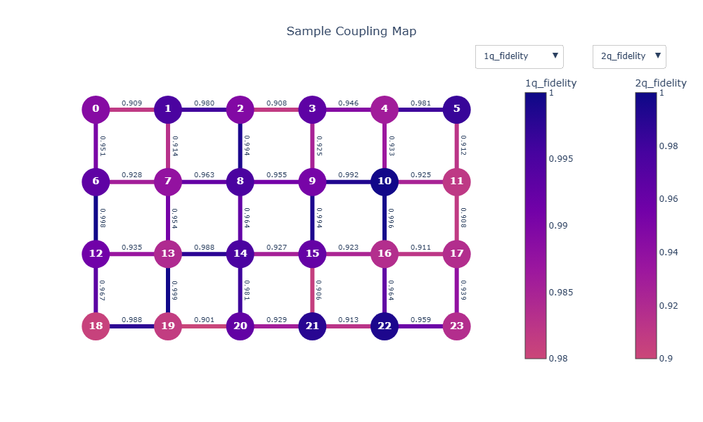

# plotly-coupling-map

量子コンピュータのカップリングマップを、Plotlyを使用してインタラクティブに可視化するPythonライブラリです。

## デモ

[こちら](https://tabae.github.io/plotly-coupling-map/) をご覧ください




## 特徴

- **インタラクティブな可視化**: Plotlyを使用した、ズームやホバー情報表示が可能な動的なカップリングマップ
- **柔軟なカラーマップ**: 量子ビットのプロパティ（忠実度、T1など）に応じて、カラーマップを変更可能
- **量子接続間ラベル**: 2量子ゲートのプロパティを視覚的に表示
- **設定ファイル**: 描画パラメータを外部ファイルで簡単にカスタマイズ

## インストール

### インストール方法

```bash
pip install git+https://github.com/tabae/plotly-coupling-map.git
```

## 使用方法

### 基本的な使い方

```python
from plotly_coupling_map.plotly_coupling_map import plotly_coupling_map

# 量子ビット定義
qubits = [0, 1, 2, 3]

# ノードの位置
node_positions = {
    0: (0, 0),
    1: (1, 0),
    2: (0, 1),
    3: (1, 1),
}

# エッジ（接続）
edges = [(0, 1), (0, 2), (1, 2), (2, 3)]

# ノードのプロパティ
node_props = {
    0: {"fidelity": 0.998, "t1": 80, "t2": 70, "readout_error": 0.02},
    1: {"fidelity": 0.997, "t1": 70, "t2": 60, "readout_error": 0.021},
    2: {"fidelity": 0.996, "t1": 85, "t2": 75, "readout_error": 0.019},
    3: {"fidelity": 0.995, "t1": 75, "t2": 65, "readout_error": 0.022},
}

# エッジのプロパティ
edge_props = {
    (0, 1): {"fidelity": 0.99, "gate_error": 0.01, "duration_ns": 200},
    (0, 2): {"fidelity": 0.995, "gate_error": 0.005, "duration_ns": 220},
    (1, 2): {"fidelity": 0.992, "gate_error": 0.008, "duration_ns": 210},
    (2, 3): {"fidelity": 0.991, "gate_error": 0.009, "duration_ns": 215},
}

# カップリングマップを生成
plotly_coupling_map(
    qubits=qubits,
    node_positions=node_positions,
    edges=edges,
    node_props=node_props,
    edge_props=edge_props,
    filename="./coupling_map.html",
    config_file="examples/sample.toml",
)
```

### 設定ファイル（TOML）

`examples/sample.toml`を参考に、描画パラメータをカスタマイズできます：

```toml
[plot]
title = "Coupling Map"

# 表示するパラメータ
node_color_key = "1q_fidelity"
edge_color_key = "2q_fidelity"
edge_label_key = "2q_fidelity"

# ドロップダウンで切り替えるパラメータ
edge_color_keys = ["2q_fidelity", "gate_error", "duration_ns"]
node_color_keys = ["1q_fidelity", "readout_error", "t1", "t2"]

# カラースケール設定
colorscale = "plasma_r"
colorscale_range = [0.5, 1.0]

# 図のサイズ
figure_width = 900
figure_height = 600

# パラメータごとの詳細設定
[plot.node_color_params.1q_fidelity]
colorscale = "plasma_r"
colorscale_range = [0.5, 1.0]
cmin = 0.99
cmax = 1.0
```

### サンプルコード

リポジトリには実用的なサンプルコードが含まれています：

```bash
python examples/sample.py
```

このスクリプトは、[こちら](https://github.com/oqtopus-team/device-gateway/blob/develop/config/example/device_topology_sim.json)のサンプルデータをもとに、カップリングマップを生成して`docs/index.html`に保存します。


## API リファレンス

### `plotly_coupling_map()`

カップリングマップを生成してHTMLファイルとして保存します。

**パラメータ:**
- `qubits`: 量子ビットIDのリスト
- `node_positions`: 各量子ビットの2D座標を持つ辞書
- `edges`: (control, target)のタプルのリスト
- `node_props`: 各ノードのプロパティを持つ辞書
- `edge_props`: 各エッジのプロパティを持つ辞書
- `filename`: 出力HTMLファイルのパス
- `config_file`: TOML設定ファイルのパス

### `load_plot_config()`

TOML設定ファイルから描画パラメータを読み込みます。
